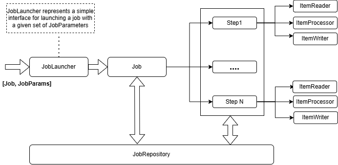

# spring-batch
1. [**Tasklet** based Step Vs **Chunk** based Step](Readme-tasklet_vs_chunk.md)
2. Listeners: (JobExecutionListener, StepExecutionListener, ProcessListener, Retry Listener, Skip Listener etc....)
3. Fault Talarant: Retry / Skip / Circuit Breaker
4. Async
5. Spring Batch Test
- Job (Step1 + Step2 + .....)
- **Scalability**: Multi-threaded Step (single process)
  - Parallel Steps (single process)
  - Remote Chunking of Step (multi process)
  - Partitioning a Step (single or multi process)
- **Reliability**: Restart the Job from the point where it failed
  - **Example**: If a job fail after processing 50,000 records out of 10 million in step 3 out of 7, you can restart it right there. No need to process all the previous steps.
  - 


---


## Architecture:


## @EnableBatchProcessing:
- It enable SpringBatch infrastructure to be bootstrap by SpringBoot like
- Settings of JobRepository, JobLauncher etc...


## JobParameter
- **JobParameters** Used to pass runtime configuration to a job.
- Job parameters allow you to pass external values (e.g., file paths, dates, flags, queue name in a message-broker, or table name etc...) to a batch job at runtime.
- Job parameters are immutable once a job is launched.
    ````java
    JobParameters jobParameters = new JobParametersBuilder()
        .addString("inputFile", "data/input.csv")
        .addLong("timestamp", System.currentTimeMillis())
        .toJobParameters();
    ````
- You can access job parameters within your batch components (e.g., `Step`, `Tasklet`, `ItemReader`) using the `@Value` annotation or `ExecutionContext`.
- 

## JobLauncher:
- **JobLauncher** Used to start a job with the provided parameters.
- It is the entry point for executing a batch job.
- It takes a `Job` and `JobParameters` as input and runs the job.

    ````java
    @Autowired
    private JobLauncher jobLauncher;
    
    @Autowired
    private Job job;
    
    public void launchJob() throws Exception {
        JobParameters jobParameters = new JobParametersBuilder()
            .addString("inputFile", "data/input.csv")
            .toJobParameters();
    
        JobExecution jobExecution = jobLauncher.run(job, jobParameters);
        System.out.println("Job Status: " + jobExecution.getStatus());
    }
    ````
- **Synchronous vs Asynchronous Execution:**
  - By default, `JobLauncher` runs jobs synchronously (blocks until the job completes).
  - You can configure it to run asynchronously using a `TaskExecutor`.


---
## S3JdbcJob
- S3 --> RDBMS
- FlatFileItemReader --> EnrichmentItemProcessor (Call REST API) --> JdbcBatchItemWriter


---


## Resources:
- [PDF - The Definitive Guide to Spring Batch](resources/the-definitive-guide-to-spring-batch.pdf)
- [Tasklets vs Chunks](https://www.baeldung.com/spring-batch-tasklet-chunk)